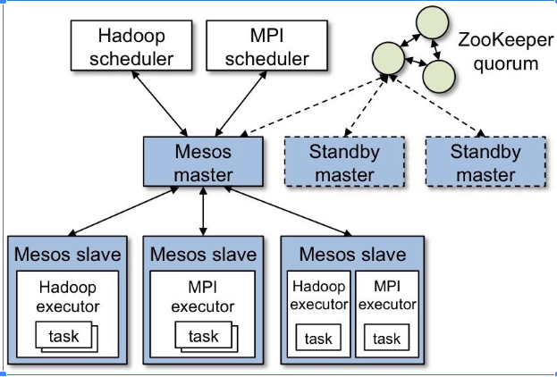
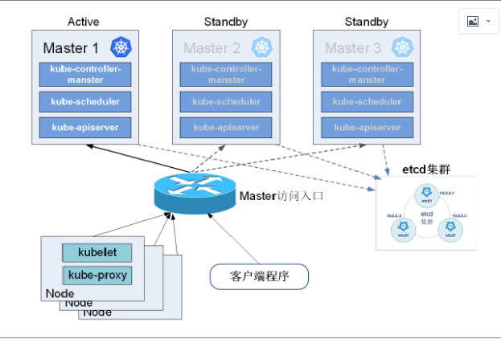
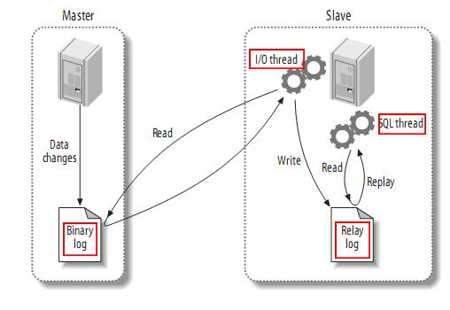
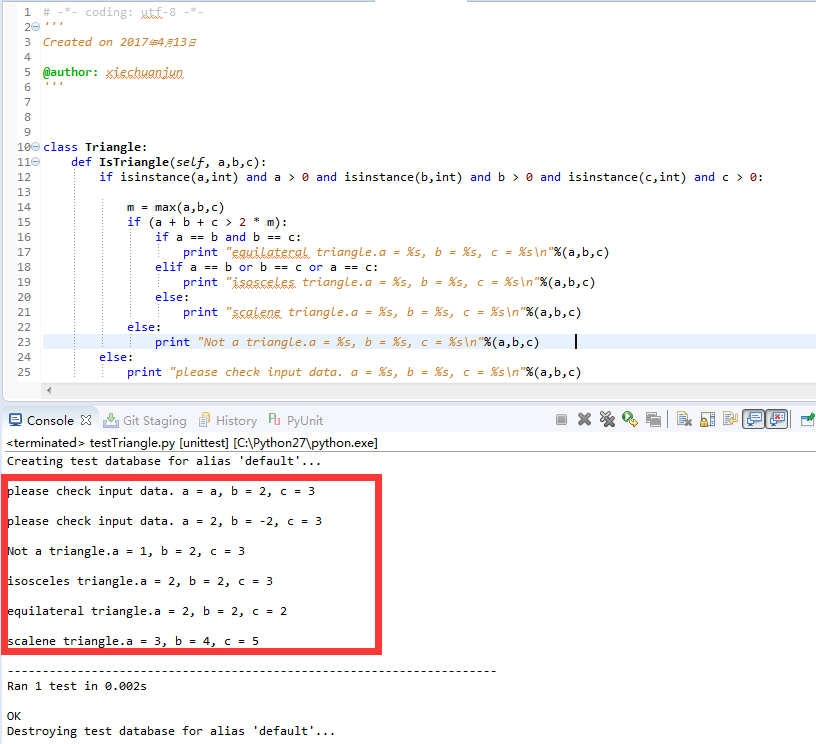

## DevOps challenge
### Topology
#### Draw a topology consisting of
- __Database (not required to be fully HA))__
- __Cache__
- __Frontend__
- __Backend__

Every component must be highly available. Only secure traffic is allowed between end-user and
the system. Remember to include subnets, load balancers etc.

## Answer:




[root@k8smaster ~]# etcdctl cluster-health
member ddb93d69258bd0d is healthy: got healthy result from http://10.10.10.11:2379
member ed96692693bd37ad is healthy: got healthy result from http://10.10.10.12:2379
member f88d42e454d897b3 is healthy: got healthy result from http://10.10.10.10:2379
cluster is healthy


## Database
### 1) The master database died unexpected due to hardware failure. Explain the process of a database failover.
### 2) How could a database failover be achieved in an automated way?


## Answer:


#### 1. As master server, will record each of your changes to the binary log.
#### 2. As a Slave from the server, the master's account will be logged on to master, read the master's Binarylog, write to its own relay log Relaylog, and then its own SQL thread will be responsible for reading this relay log and executing it again. The changes to the primary server are synchronized to the server
#### 3. when the database in the cluster fails over, the virtual IP of the external service is transferred.
#### 4. monitoring mechanism to ensure that when a host failure, can determine the success of the Failover


## Bonus question
### A clumsy sysadmin accidently removed execute permissions on /bin/chmod, by running the command
### chmod 400 /bin/chmod
### How would you regain execute permissions on this binary?

## Answer:
```
[root@k8snode2 ~]# chmod 400 /bin/chmod
[root@k8snode2 ~]# ll /bin/chmod
-r--------. 1 root root 58584 Nov  6 04:46 /bin/chmod
[root@k8snode2 ~]# chmod
-bash: /usr/bin/chmod: Permission denied
[root@k8snode2 ~]# python
Python 2.7.5 (default, Nov  6 2016, 00:28:07)
[GCC 4.8.5 20150623 (Red Hat 4.8.5-11)] on linux2
Type "help", "copyright", "credits" or "license" for more information.
>>> import os
>>> os.chmod("/bin/chmod", 0755)
>>> exit()
[root@k8snode2 ~]# ll /bin/chmod
-rwxr-xr-x. 1 root root 58584 Nov  6 04:46 /bin/chmod
[root@k8snode2 ~]# chmod
chmod: missing operand
Try 'chmod --help' for more information.
```

## Programming assignment
### Write a function that determines the type of a triangle. It should take the lengths of the triangle's three sides as input, and return whether the triangle is equilateral, isosceles or scalene. Also consider tests, documentation and/or errors. Remember to include documentation for how to run the program.

### Please upload the code to github or send it in an email along with the answers to the questions above.

## Answer:

+ [Code](https://github.com/xiechuanj/devopsDemo.git)

